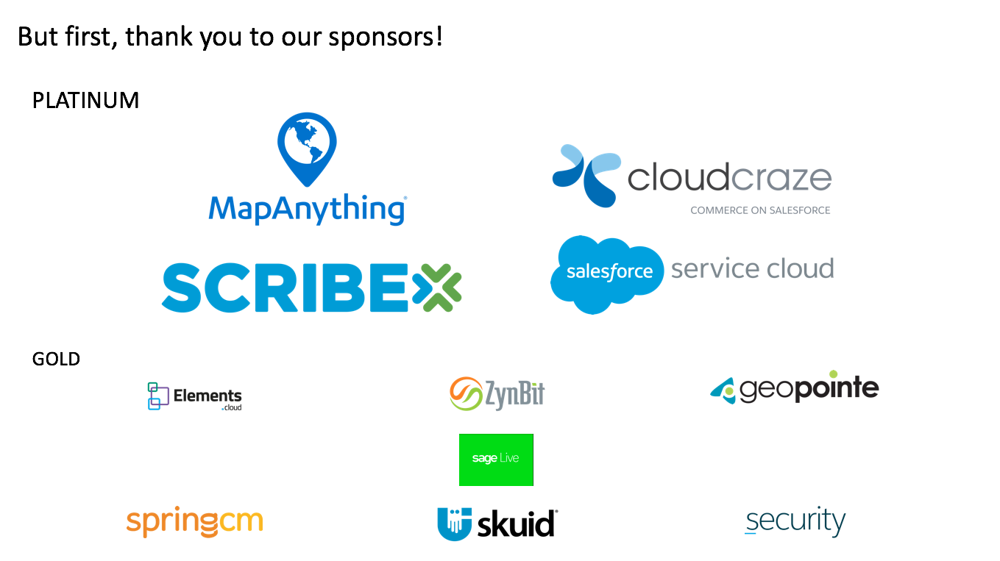
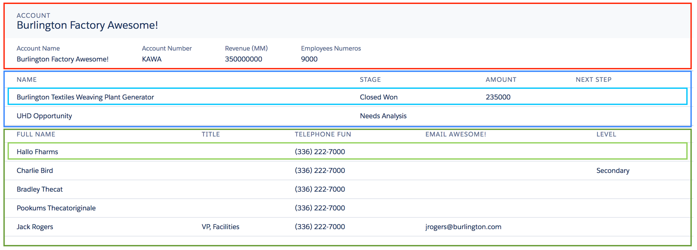
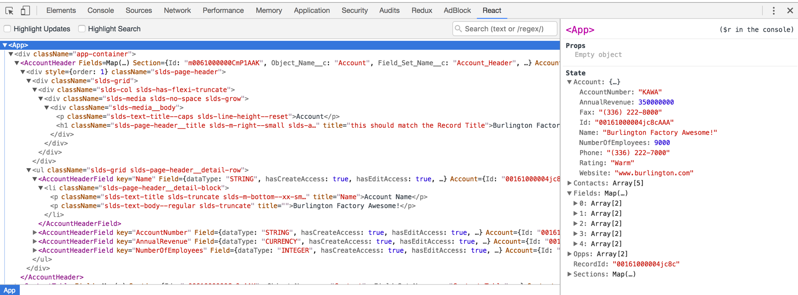
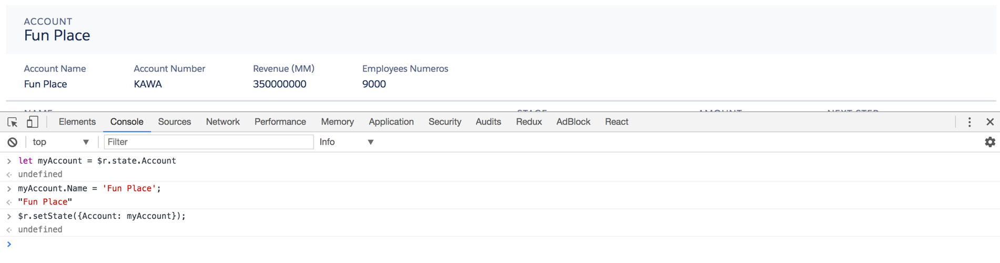
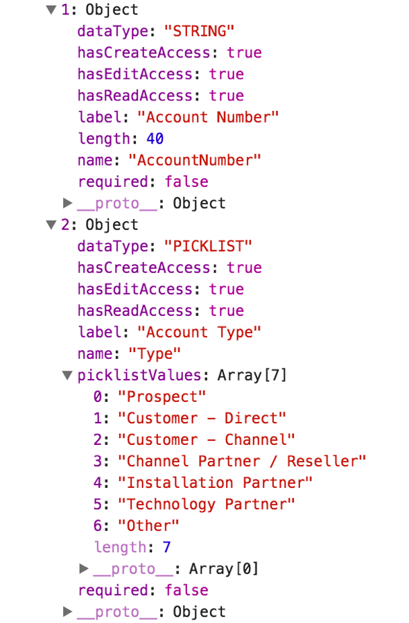
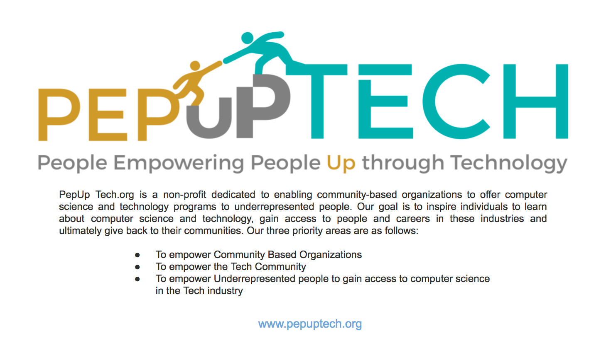

## Building React Apps in Salesforce


## Sponsors!



## Agenda
- What is React?
- Why (not) use React?
- React + Salesforce + You
- Advanced Patterns
- Demo!
- Questions & Answers

Speaker Note:
BEFORE DIVING INTO MATERIAL:
- Ask by show of hands: who is familiar with a “Single Page App”?
- Ask by show of hands: who has written JavaScript before?
- Ask by show of hands: who is familiar with ReactJS?


## What is React?


## What is React?
- JavaScript library created + maintained by Facebook
- Built for creating UIs
- Embraces MV* to as View layer to your Model’s data
- Efficiently handles updates to browser’s DOM
- Mixes HTML and CSS into JS as “JSX”


## What is React?
- Components are composed together to create an app
- Data are stored as “state” at highest level necessary
- Component state and functions are passed as “props”
- Use “props” to render, execute functions
- Only can modify state; rest of app inherits as props
- Uses “virtual DOM” to identify changes to browser’s DOM


## Why (not) use React?
Where's my Safe Harbor slide?


## Why use React?
- Handles simple CRUD apps, data heavy pages
- Large community of web devs + designers
- `npm install` any packages to aid development
- Augment your CRM dev team with your website’s dev team
- Drop into a Visualforce page now, Lightning Component later
- Keep UI the same when switching out the backend


## Why not use React?
- React is not maintained by Salesforce, bugs can happen
- Lack of “metadata awareness” when logic baked into JS
- Existing team has learning curve, hiring is more difficult
- Large amount of local tooling is (realistically) required
- Requires using third party components (or building your own)


## React + Salesforce + You
A journey into tooling, and treating the platform like an API.


## Thinking in React
- Sketch the UI on paper, or take a screenshot of a prototype
- Identify areas that can act as components
	- Do not be afraid to nest components
	- If you can abstract reasonably, do so
- Leverage others’ work to define components (e.g. SLDS)


## Annotate Your Prototypes



## Metadata Model
- Apex Controller facilitates queries, DML via RemoteAction methods
- Visualforce Page acts as container in which to mount the app
- Static Resource contains bundled components, helpers, third-party modules, etc
- Looks similar to importing JS from a jQuery UI project


## Visualforce Page Markup
```html
<apex:page standardStylesheets="false" showHeader="false" showChat="false" sidebar="false" controller="AccountManagementController" docType="html-5.0" applyBodyTag="false">
<body>
	<link rel="stylesheet" type="text/css" href="{!URLFOR($Resource.SLDS, 'assets/styles/salesforce-lightning-design-system-vf.min.css')}" />
	<div id="app" class="react-vf"></div>
	<script type="text/javascript" src="{!URLFOR($Resource.AccountManagement, 'js/app.js')}"></script>
</body>
</apex:page>
```


## Development Tooling
- Use [Node.js](https://nodejs.org/en/download/) and [npm](https://www.npmjs.com/) to set up local project
- Install [React](https://facebook.github.io/react/docs/installation.html) to create components, establish state
- Install [ReactDOM](https://facebook.github.io/react/docs/react-dom.html) to mount the app into the browser’s DOM
- Use [React Dev Tools](https://chrome.google.com/webstore/detail/react-developer-tools/fmkadmapgofadopljbjfkapdkoienihi?hl=en) for troubleshooting
- Optionally...
	- Install [Babel](https://babeljs.io/) to transpile ES2015/ES6 for older browsers
	- Install [Webpack](https://webpack.js.org/guides/installation/) to bundle code into single asset files


## Node Project's `package.json`
```json
{
  "name": "dynamic-page-mapping",
  "version": "1.0.0",
  "description": "",
  "main": "webpack.config.js",
  "author": "",
  "license": "ISC",
  "devDependencies": {
    "babel-core": "^6.22.1",
    "babel-loader": "^6.2.10",
    "babel-preset-es2015": "^6.22.0",
    "babel-preset-react": "^6.22.0",
    "css-loader": "^0.26.1",
    "style-loader": "^0.13.1",
    "webpack": "^2.2.1",
    "webpack-dev-server": "^2.4.5"
  },
  "dependencies": {
    "react": "^15.4.2",
    "react-dom": "^15.4.2"
  }
}
```


## Babel's Config File
```json
{ "presets": [ "react", "es2015" ] }
```


## Webpack's Config File
```js
let path = require('path');

module.exports = {
	entry: './dev/js/App.js',
	output: {
		path: path.resolve(__dirname, './resource-bundles/AccountManagement.resource/js'),
		filename: 'app.js'
	},
	module: {
		loaders: [
			{ test: /\.js$/, exclude: /node_modules/, loader: 'babel-loader' },
			{ test: /\.css$/, loader: "style-loader!css-loader" }
		]
	}
};
```


## React Dev Tools



## React Dev Tools



## Advanced Patterns
Because JS has advanced (too) much in the last few years.


## Wrapper Class for State
- Use single request to retrieve a “StateBundle”
- Deconstruct StateBundle into different objects/collections
- Call `setState()` to assign data to React’s state
- Return StateBundle back after DML, repeat deconstruction


## Constructing `StateBundle` in Apex
```java
global class StateBundle
{
	public List<Resource> resources;
	public List<Card> cards;
	public String recordTypeName;
}
```


## Parsing `StateBundle` in Client Side JS
```js
export function getInitialState(recordId, context) {
	Visualforce.remoting.Manager.invokeAction(
		'T1ResourceVisualizationController.getInitialState',
		recordId, true,
		function(result, event) {
			if(event.statusCode === 200) {
				// decompose result
				let Cards = result.cards;
				let ResourceMap = buildResourceMap(result.resources);
				let FilterMap = buildFilterCounts(Cards, context.state.SelectedView);

				// get default filters
				let Filters = defaultFilters;

				// set state 
				context.setState({
					RecordTypeName: result.recordTypeName,
					Cards,
					ResourceMap,
					FilterMap,
					Filters
				});
			} else {
				console.error('Houston, we have a problem! 🌮');
			}
		}
	);
}
```


## Redirecting to `localhost`
- Serve app to localhost using [webpack-dev-server](https://webpack.github.io/docs/webpack-dev-server.html)
- Redirect browser requests to localhost using [Requestly](http://www.requestly.in/)
- Prevent deploying static resource bundle
- Speed up your development cycles


## Redirecting to `localhost`
Start webpack-dev-server via Terminal...
```
webpack-dev-server --content-base resource-	bundles/YourResourceName.resource --https
```

Using Requestly, replace...
	`/https.*\/resource\/[0-9]+\/YourResourceName/ig`
with...
	`https://localhost:8080`


## Metadata Driven Rendering
- Abstract app further with smaller components
- Use Field Sets and Custom Metadata Types to allow
- non-developers to control UI features
- Describe fields to support i18n and custom translations
- Leverage [FieldSetReactor](https://github.com/rogeramitchell/FieldSetReactor) as utility to compose server-side details, serve with app’s StateBundle (i.e. app data)


## Incorporating Field Sets with `FieldSetReactor`
```java
@RemoteAction
public static List<FieldSetReactor.FieldDetails> getFields(String fieldSetName, String objectName)
{
return FieldSetReactor.getFieldDetails(fieldSetName, objectName);
}
```


## Field Details from `FieldSetReactor`



## Demo Time!
Awww yeah...


Speaker Note:
- Changes to field set updates the UI
- Changes to labels updates the UI
- React Dev Tools for debugging + viewing metadata abstraction
- Requestly for efficient development


## Helpful Resources
- [React for Beginners by Wes Bos](https://reactforbeginners.com/)
- [ES6 for Everyone by Wes Bos](https://es6.io/)
- [Building Admim Configurable UIs by Roger Mitchell](https://medium.com/@RogerMitchell/building-admin-configurable-uis-with-salesforce-and-react-88578bcc4217)
- [Using Requestly in VF Dev Workflow by Roger Mitchell](https://medium.com/@RogerMitchell/using-requestly-in-visualforce-development-workflow-dd64e5f5998f)
- [Christophe Conraet’s React collection](http://coenraets.org/blog/category/react-js/)


## PEP UP TECH!



## Questions?


## Thanks y'all!

**Roger Mitchell**

Cofounder, Bluestone Labs

[@RogerMitchell](https://www.twitter.com/rogermitchell)